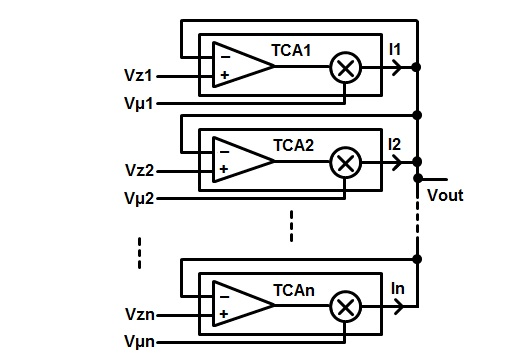
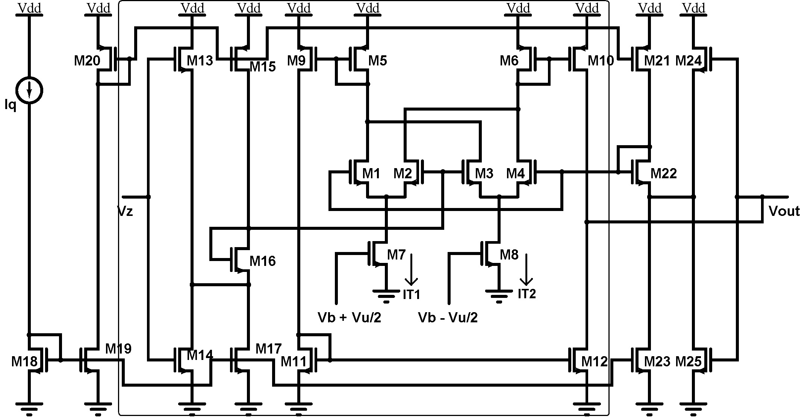
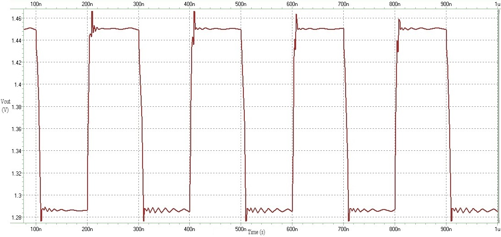
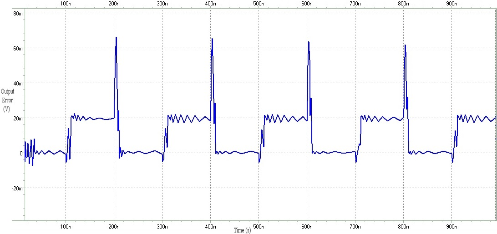

#  Center of Gravity Defuzzifier - Analog CMOS Implementation
This is an analog circuit implementation of discrete center of gravity defuzzifier in CMOS 0.35 &#956;m process. Defuzzifiers are used as the last stage in a fuzzy system to translate the fuzzy logic data back to normal *'crisp'* information. Center of gravity is in turn one of the mostly used defuzzification methods.

## Description
The complete description of the design and implementation can be found in our paper ([pdf](./docs/2010-ICEDSA-Defuzzifier.pdf) or [IEEE Xplore](https://doi.org/10.1109/ICEDSA.2010.5503081)). Center of gravity defuzzification is essentially a weighted average of sample elements in the fuzzy system, weighted by their membership functions. The following structure ensures the output would be equal to discrete center of gravity of inputs:

  

To implement this structure, the below circuit is used, which instead of using the traditional multiplier-divider style, uses transconductance amplifiers (TCA) as a multiplier with voltage-input current-output by exploiting the voltage follower aggregation principle to increase speed and reduce chip area:

  

The circuit inside the frame is the TCA. Outside of that is shared among all the transconductance amplifies. 
As an illustration, the response of the defuzzifier to a repetition of two states of membership values for a set of seven sample elements is shown below:

  

The error for the same out is as follows that is negligible compared to the scale of the output:

  

## The Code
The Defuzzifier is implemented in HSPICE for simulation in CMOS 0.35 &#956;m process. In the time of the original simulations, a TSMC 0.35 &#956;m library file was used. You may use other libraries, probably with some minor alterations. There is one netlist file that contains the code to the circuit and performs DC sweep, transient, and corner tests in simulation.

# Cite
You may refer to this work by citing our published [paper](https://doi.org/10.1109/ICEDSA.2010.5503081).

# Contact
I can be reached at hoseini@nevada.unr.edu.
